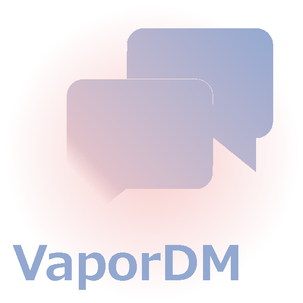

# VaporDM

<p align="center">
    
</p>
<p align="center">
    <a href="http://swift.org">
        
    </a>
    <a href="https://github.com/vapor/vapor">
        
    </a>
    <a href="https://raw.githubusercontent.com/shial4/VaporDM/master/license">
        
    </a>
    <a href="https://travis-ci.org/shial4/VaporDM">
        
    </a>
    <a href="https://circleci.com/gh/shial4/VaporDM">
        
    </a>
    <a href="https://codecov.io/gh/shial4/VaporDM">
        
    </a>
    <a href="https://codebeat.co/projects/github-com-shial4-vapordm-master">
        
    </a>
</p>
VaporDM is a simple extension for [Vapor](https://github.com/vapor/vapor) works with [Fluent](https://github.com/vapor/fluent). Allows you to integrate chat system into your project. VaporDM doesn't require you to create new database tables or Fluent models. He does it for you. Make your `User` model conform to [DMParticipant](https://shial4.github.io/VaporDM/Protocols/DMParticipant.html) or completely change the way you write model code. It can be used on any model with ease and init VaporDM with it. Model which conform to protocol will represent senders and receiver object type. 

## 🔧 Installation

Add the following dependency to your `Package.swift` file:
```swift
.Package(url:"https://github.com/shial4/VaporDM.git", majorVersion: 0, minor: 1)
```

## 💊 Usage

### 1 Import

It's really easy to get started with the VaporDM library! First you need to import the library, by adding this to the top of your Swift file:
```swift
import VaporDM
```

### 2 Initialize

The easiest way to setup VaporDM is to create object for example in your `main.swift` file. Like this:
```swift
let drop = Droplet()
let dm = VaporDM<User>(for: drop)
```

### 3 Configure

Beside default configuration you can add your own configuration object which correspond to protocol `DMConfiguration`
```swift
struct MyConfiguration: DMConfiguration {
    var pingIterval: Int? { return 5 }
}
VaporDM<User>(for: drop, configuration: MyConfiguration())
```
Default value use `DMDefaultConfiguration` which specify ping time interval to 10 seconds. If you will return nil in your configuration object, server will skipp ping part to hold connection.


VaporDM is an extension to an existing project. Based on your `User` DataBase model and Vapor's `Fluent` is extending your DataBase with two additional model for storing messages and chat rooms.
Your `User` model needs to conform to `DMParticipant` protocol. This protocol require implementation of two methods
- 1 `directMessageLog(_ log: DMLog)` 
- 2 `directMessageEvent(_ event: DMEvent<User>)`

The third method is optional
- 3 `directMessage(_ sender: User, message: JSON, type: DMType) -> JSON?` 

Ad 1. First protocol method deliver VaporDM logs to you. If you are using any logging server this method might be useful for you to report them futher. `DMLog` store information about thrown error, warning or any other informations. When something wrong happen you will know.

Ad 2. Second function deliver two events. One tells you about users group to which real time message over the `WebSocket` was delivered successfully. Second inform you about users group to which message wasn't deliver, in that case you can handle this callback and send to them notification, if you have server with mobile users. 

Ad 3. Last protocol message is optional and is called everytime before message is going to be send to receivers. They can be chat room participants or every user which is interested in this message, for example about your `online` status. However your `User` model have additional settings like privacy or chat visibility. In that case you may cancel message before is sent by returning nil. Default implementation should redirect `message` argument as a return object.

#### DMParticipant Protocol
```swift
extension User: DMParticipant {
    public static func directMessage(_ sender: User, message: JSON, type: DMType) -> JSON? {
        return message
    }
    public static func directMessageLog(_ log: DMLog) {
        print(log.message)
        
    }
    public static func directMessageEvent(_ event: DMEvent<User>) {
        let users: [User] = event.users
        print(users)
    }
}
```

## 📚 [Documentation](https://shial4.github.io/VaporDM)
* ### 🗂 [Endpoints](https://shial4.github.io/VaporDM/Classes/DMController.html)
* ### 💬 [Message Flow](https://shial4.github.io/VaporDM/Protocols/DMParticipant.html)
* ### 🗄 [Data Base](https://shial4.github.io/VaporDM/Classes.html)

## ⭐ Contributing

Be welcome to contribute to this project! :)

## ❓ Questions

You can join the Vapor [slack](http://vapor.team). Or you can create an issue on GitHub.

## 📝 License

This project was released under the [MIT](license) license.
